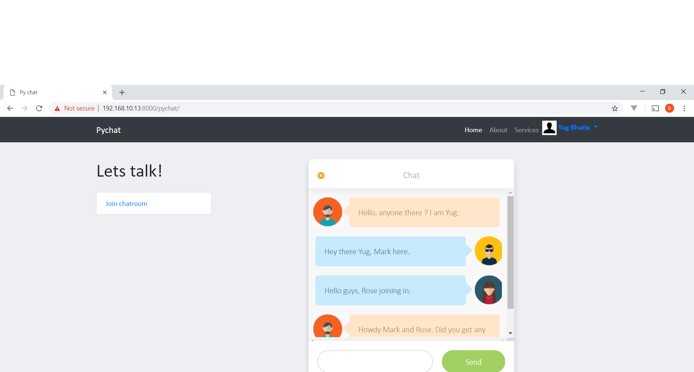

# pychat

This chat server project makes use of Django channels which is an implementation of  web sockets.



## Installation
This project comes with a Docker file. This file can be built into a Docker image that will install the entire set up including Python3, Django 2 and any other dependencies.The resultant image also configures the code and starts the required services within the Docker container.

A sample VM that can be spawned with Vagrant is also provided. This VM has a Ubuntu Xenial image; the pre-requisite Docker package gets installed as part of this VM. 

### Steps
1. To install the base VM :
```
cd pychat/
vagrant up
```
2. If the base VM with Docker is already installed, we need to copy a particular directory structure into the host VM.

Under `/vagrant` directory of host VM, the following directory structure needs to be present:

```

├── setup
│   ├── docker
│   │   ├── Dockerfile
│   │
│   ├── target
│   │   └── scripts
│   │       ├── install_chatserver_container.sh
│   │       ├── install_chatserver_main.sh
│   │       ├── install_django2.sh
│   │       ├── install_python3.sh
│   │       ├── install_redis.sh
│   │       ├── install_vm.sh
│   │       └── start_pyserver.sh
│   └
├── src
│   └── chatproject
│       
```

3.To build the Docker image and run the code:
```
cd /vagrant
dos2unix setup/target/scripts/install_chatserver_main.sh  setup/target/scripts/install_chatserver_main.sh
chmod +x setup/target/scripts/install_chatserver_main.sh
setup/target/scripts/install_chatserver_main.sh
```

## License

Copyright © 2019 Binita Bharati <br />
Distributed under the Apache license 2.0. 
